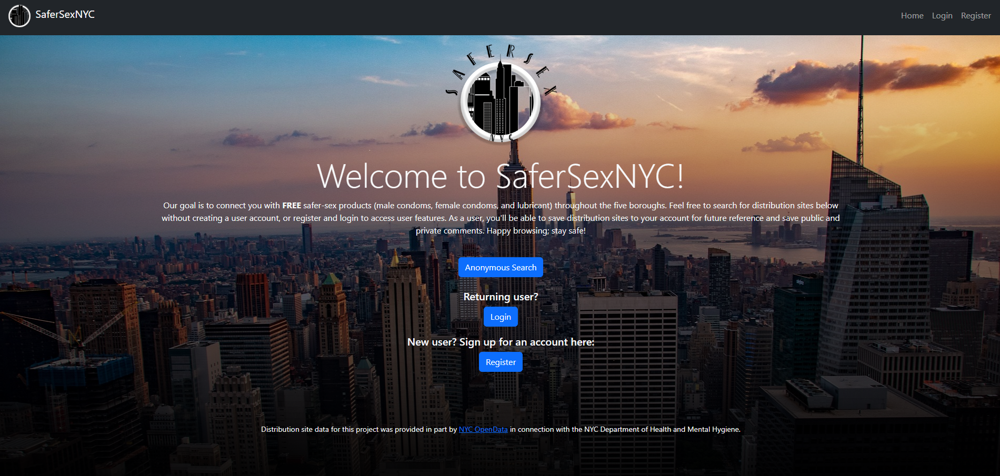
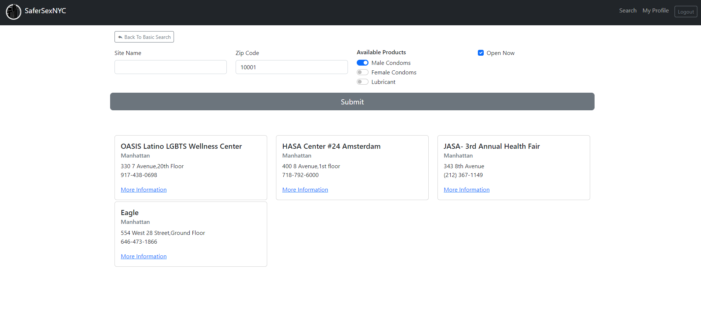
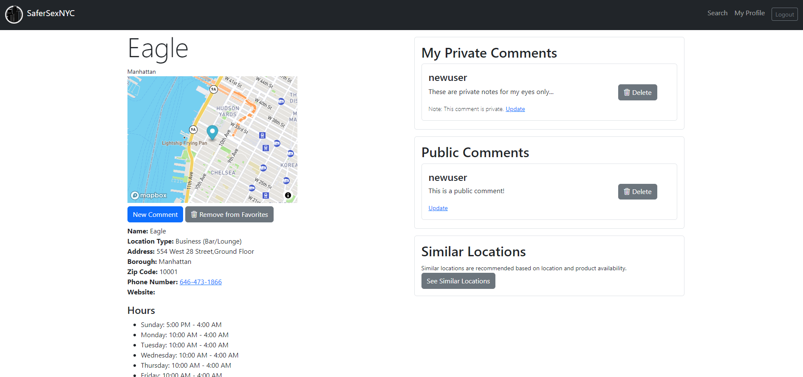
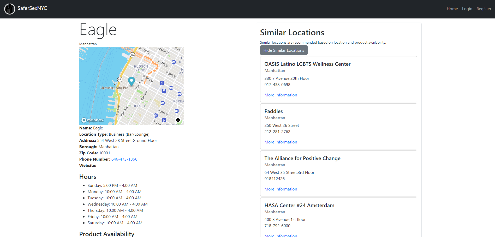
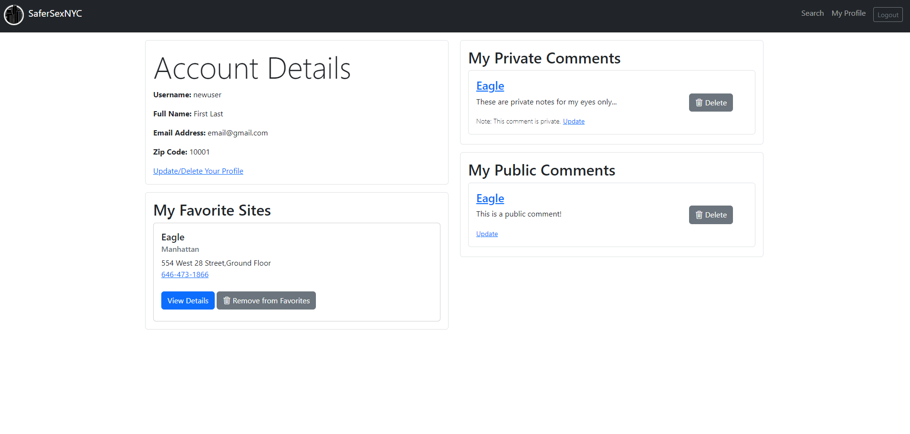

# SaferSexNYC Web Application

This application can be viewed at https://safer-sex-nyc.onrender.com

### Purpose:

The goal of this application is to connect users with free safer-sex products (male condoms, female condoms, and lubricant) distribution sites throughout the five boroughs. An anonymous user can search for distribution sites without creating a user account, or can register and login to access user features. After registration, a user is able to save distribution sites to the user account for future reference and save public and private comments.

### Features:

Features of this application include:

- User profiles (login and logout) with the ability to update user information, change user password, or delete the entire account all together; utilizing Bcrypt for secure hashed passwords
- Distribution site search (anonymous or logged-in) including:
  - Basic search (by borough)
  - Advance search: a user can choose any combination of search criteria including site name, zip code, product availability, and "Open Now" which determines the current time and compares it to each sites open hours
- User comments that can be marked as public or private depending on the nature of the content
- Users have the ability to save distribution sites to their account for future reference as "Favorites"
- Distribution site detail pages with Mapbox API content, location information, hours, and product availability
- Similar Site suggestion based on product availability and location
- JavaScript AJAX implementation with the internal database to keep the front-end and back-end in sync without page refresh (this applies to all searching features, comment deletion, and creation/deletion of "Favorite" sites)

### Standard User Flow:

When first visiting the webpage, a user arrives on a landing page/homepage that provides the option to search anonymously, login, or create a user account.

 _Homepage_

As an anonymous user, the user is able to search with basic or advanced features and click through to site detail pages.

 _Advanced Search_

These detail pages display Mapbox API content, location information, hours, product availability, and "Similar Site" recommendations.

 _Active user site detail page_

 _Similar site recommendation display_

If a user chooses to create an account and login, the user is able to save sites to the user account as "Favorites", create comments for public consumption, and create private comments for personal reference. Only logged-in users have access to public comments on the site detail page.

 _Anonymous user site detail page_

Examples of comments might include:

_"This location is great! Products are located in a fishbowl on the counter near the front door. Susan, who was working at the cash register, is very friendly and welcoming!" (Public Comment)_

_"I had a great conversation with Susan behind the counter about her dog, Frank, and how much he looks like Billy and Garrett's dog. She was super friendly and I'll have to remember to ask about Frank the next time I stop in." (Private Comment)_

Users also have the ability to update and delete comments, including changing status between public and private. A user can update their profile information, change a password, or even delete the account all together.

 _User account detail page_

From the user profile, a user can view all of their Favorite sites and all of their comments, both public and private.

### API:

_NYC OpenData API / NYC Condom Availability Program - HIV condom distribution locations_ at https://dev.socrata.com/foundry/data.cityofnewyork.us/4kpn-sezh

- This resource provided all of the distribution site details.

_Mapbox_ at https://www.mapbox.com/

- This resource provided interactive JavaScript maps for the site detail page.

### Technology Stack:

- Bcrypt
  - Password hashing
- Bootstrap
  - CSS/JS framework, icons
- Flask
  - Web framework
- gunicorn
  - Production server
- Jinja2
  - HTML templating
- jQuery
  - AJAX, DOM manipulation
- jsonpickle
  - Serialization/deserialization of complex Python objects
- python-dotenv
  - Environment variable loader
- sodapy
  - Python client for the Socrata Open Data API
- SQLAlchemy
  - Python SQL toolkit and object relational mapper
- WTForms
  - Form validation and rendering

### Notes:

The included facility_seed.py file creates the tables for the database and pulls all distribution site information from the API to initialize the database. A .env file must be included in the root directory with the following variables defined:

- API_APP_TOKEN
- MAPBOX_ACCESS_TOKEN
- DATABASE_URL
